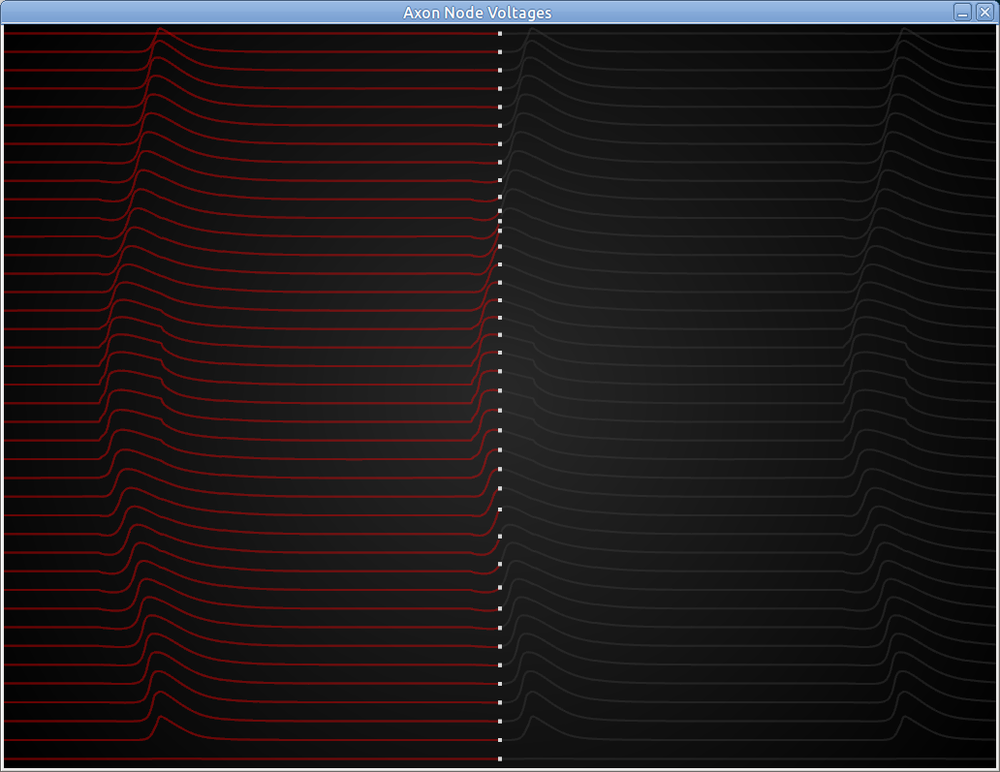

# McIntyre, Richardson, and Grill Axon Model

Reimplementation of the axon model from McIntyre, Richardson, and Grill (2002) in C++.

Visualization (implemented using openFrameworks) is also addded.


## Build

- Obtain the source:

```bash
git clone https://github.com/mm318/mrg-cpp.git
cd mrg-cpp
```

- Setup openFrameworks 0.11.2 and its CMake build:

```bash
wget https://github.com/openframeworks/openFrameworks/releases/download/0.11.2/of_v0.11.2_linux64gcc6_release.tar.gz \
    && tar xvzf of_v0.11.2_linux64gcc6_release.tar.gz -C external_libs/ \
    && rm of_v0.11.2_linux64gcc6_release.tar.gz

# optional if dependencies are already installed
sudo external_libs/of_v0.11.2_linux64gcc6_release/scripts/linux/ubuntu/install_dependencies.sh
```

- Build like an usual CMake project, for example:
    
```bash
mkdir build
cd build
cmake ..
make -j4
```


## Usage

```
mrg_axon_model [--record-video=<video name>] <axon file> <V_fe (mV)> <V_applied (mV)> <duration (ms)> <stim start (ms)> <stim end (ms)>
```

The axon file is in the format (tab separated): `<x (m)> <y (m)> <z (m)> <Ve_pulse (V)>`

### Example

```bash
mrg_axon_model reference/activateF.txt --record-video=replay 1 3 3 2 2.5
```




## History

The original implementation was in NEURON, published in:

McIntyre, C., Richardson, A. & Grill, W. (2002). Modeling the excitability of mammalian nerve fibers: Influence of after potentials on the recovery cycle. J. Neurophysiol., 87, 995–1006.

It was then reimplemented in MATLAB, published at:

https://code.google.com/p/mrg-matlab/

This is a reimplementation of the MATLAB code (also found in ./reference/) in C++.
